# KubeLemon

# Getting Started

## Prerequisites

- [KubeVela](https://kubevela.io/docs/install)

## Quickstart

1. Start apiserver:
   ```sh
   make run-apiserver
   ```
2. Start dashboard:
   ```sh
   make run-dashboard
   ```
- The api swagger will be served at http://localhost:8080/swagger/
- The dashboard will be served at http://localhost:8000

# To-do

- Namespaces support
- More Component/Trait forms
- Provide Trait/Component forms as plugins
- Metric chart
- More...

# Screenshot

## Application

### Application List

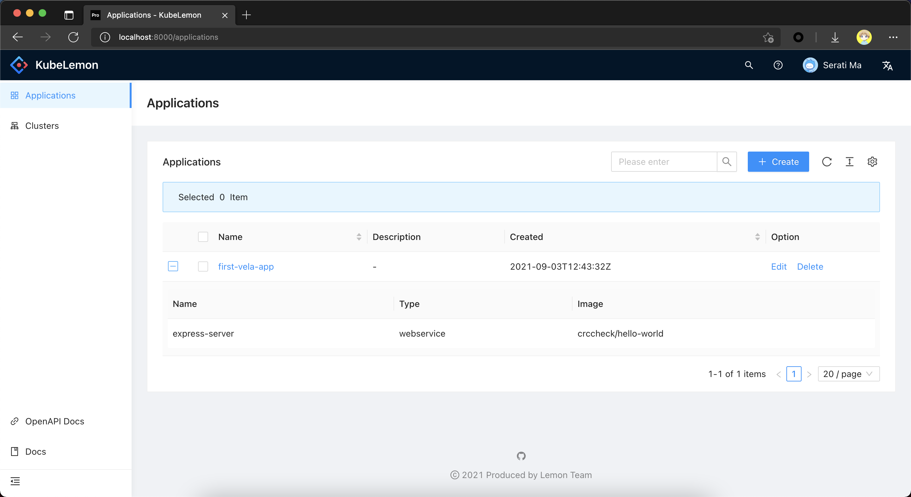

### Application Create

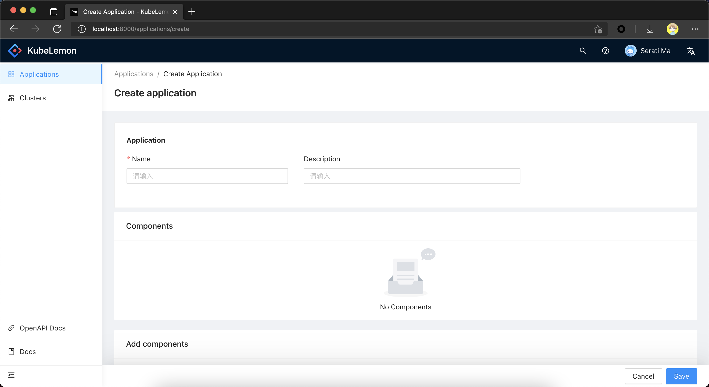

### Application Edit

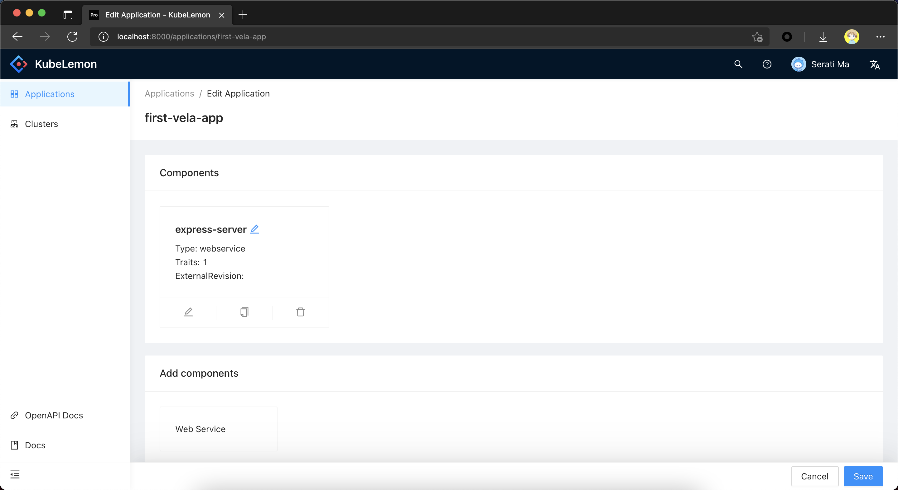

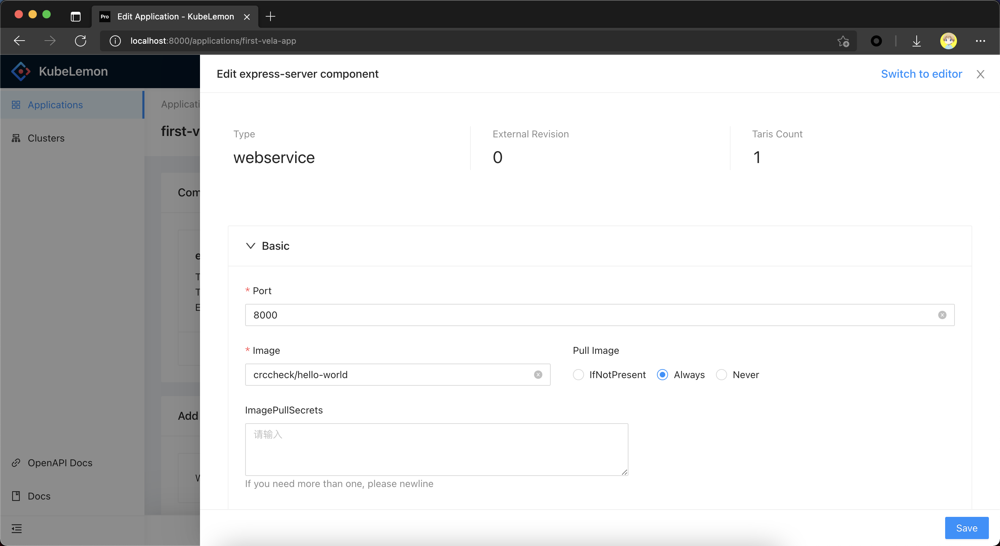

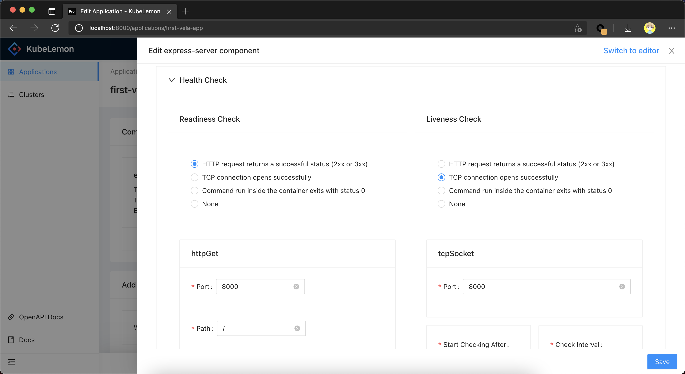

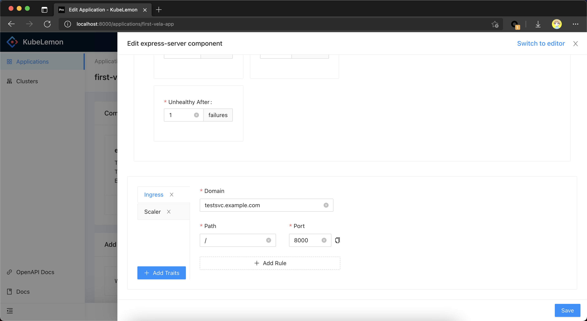

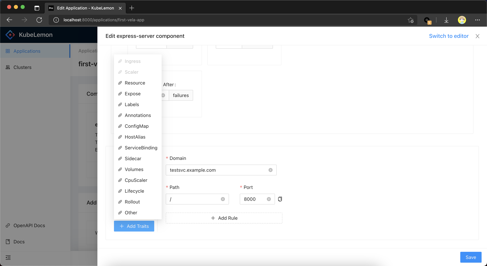

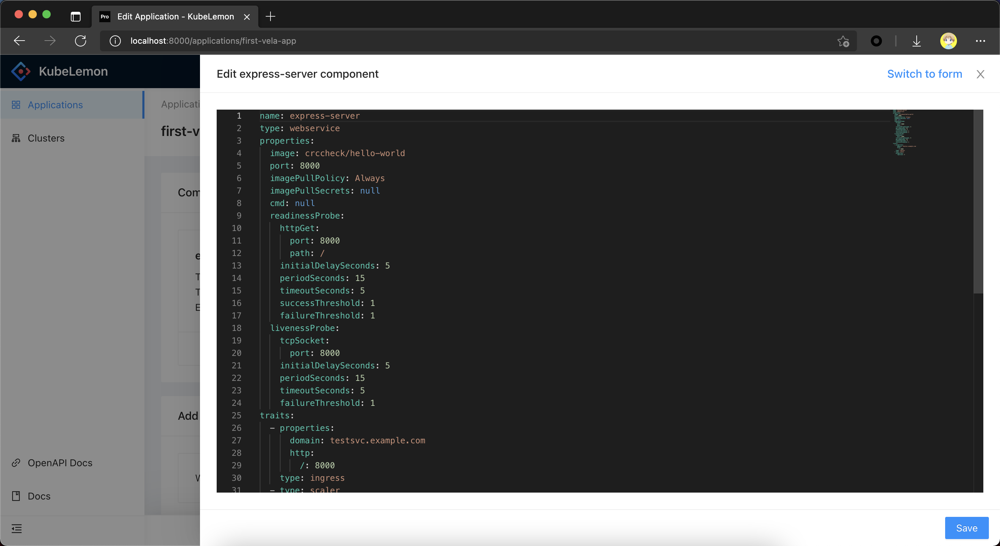

## Clusters

### Cluster List

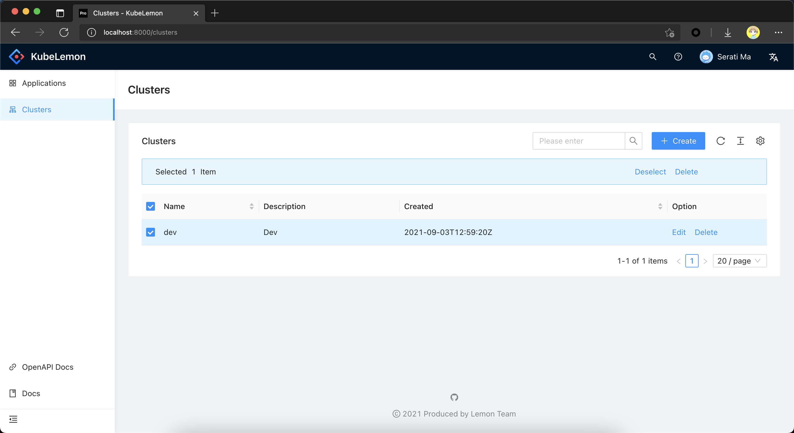

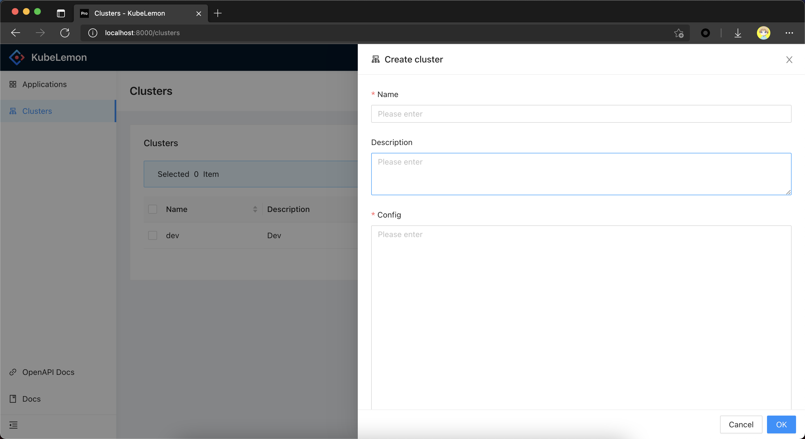

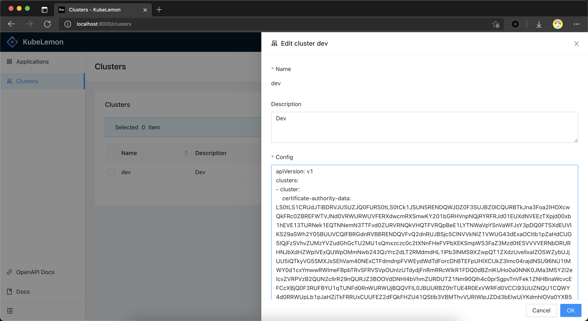

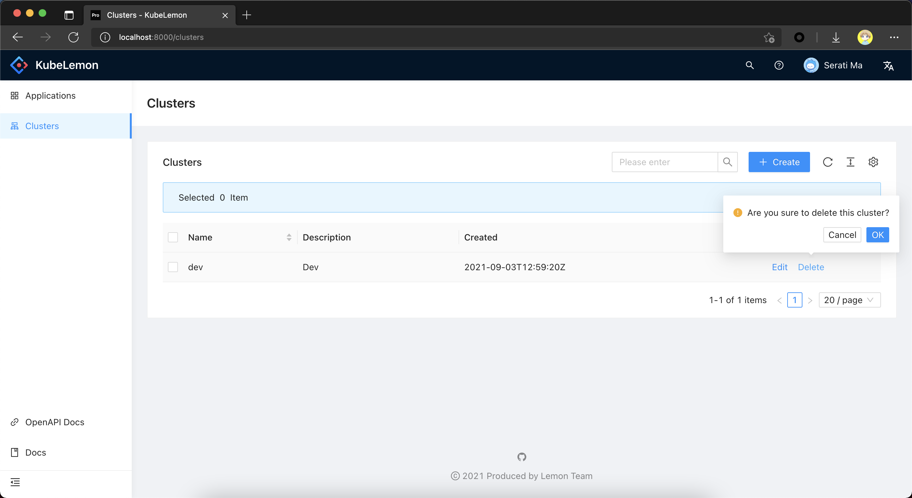

## OpenAPI

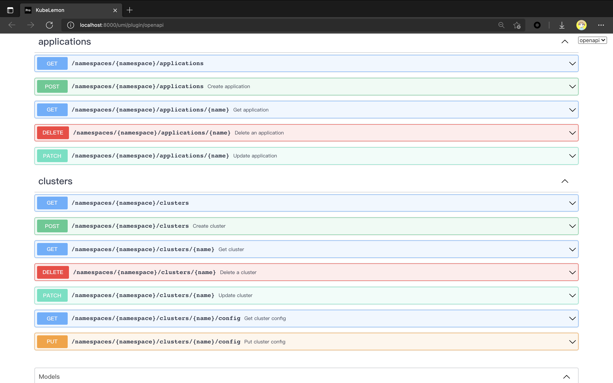
